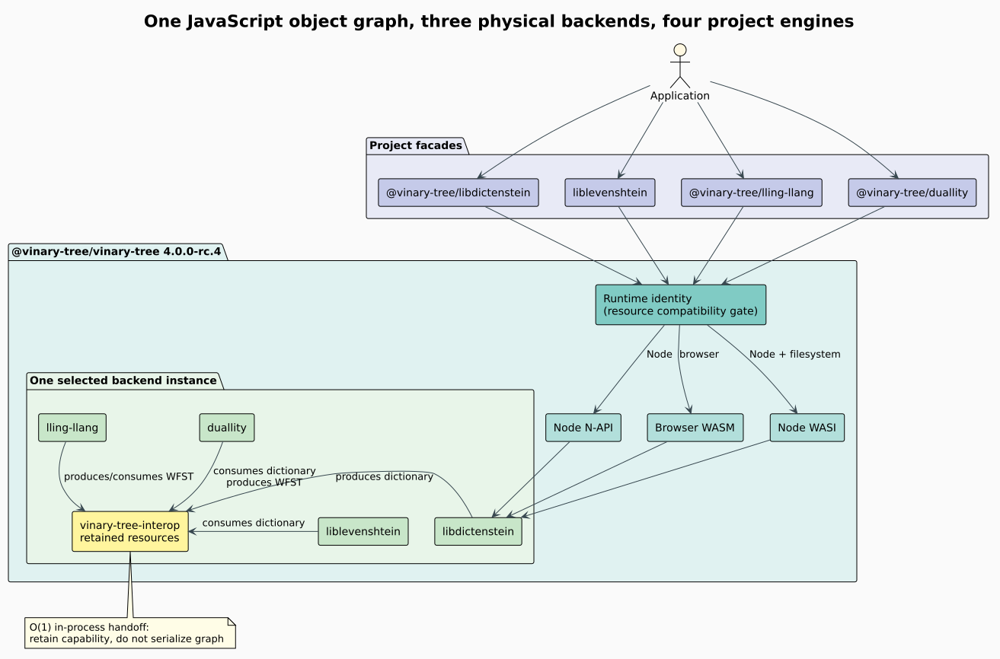

# Runtime architecture

The JavaScript runtime is the single binary owner for the Vinary Tree project
family. It combines four independently versioned Rust projects behind one
JavaScript object graph while using
[`vinary-tree-interop`](https://github.com/vinary-tree/vinary-tree-interop) as
the neutral resource contract between them.



## Terms and boundaries

A **facade** is the project-specific JavaScript or TypeScript package a user
imports. A **backend** is one physical implementation: Node-API (N-API),
browser WebAssembly (WASM), or WebAssembly System Interface (WASI). A
**resource** is the retained two-word capability defined by the interop ABI.
A **runtime identity** is an immutable JavaScript object shared by every facade
created from one backend instance.

The runtime enforces this invariant:

```math
\operatorname{transfer}(x,A,B)\text{ is valid}
\iff
x.\operatorname{runtimeIdentity}=A.\operatorname{runtimeIdentity}
=B.\operatorname{runtimeIdentity}.
```

This prevents a pointer or linear-memory handle produced by one binary from
being passed to another binary that merely happens to expose the same method
names. Within one identity, dictionary snapshots move from libdictenstein to
liblevenshtein or duallity in constant time: ownership is retained, not
serialized.

## Backend equivalence

| Backend | Host boundary | Distribution payload | Additional capability |
|---|---|---|---|
| Node native | Stable N-API C ABI | Platform `.node` prebuild | Lowest call overhead |
| Browser WASM | `wasm-bindgen` JavaScript glue | ES module plus `.wasm` | Browser portability |
| Node WASI | Explicit linear-memory functions | WASI `.wasm` | Preopened filesystem access for persistent ARTrie |

All backends expose the same dictionary collection conventions, streaming
query cursors, scalar weighted finite-state transducers (WFSTs), dynamic
semiring contexts, dynamic lattice values, edit-distance functions, and
deterministic close operations.
Backend-specific code may change marshalling, never observable algebra, query,
or snapshot semantics.

Host-defined JavaScript WFSTs, semiring contexts, and lattice values use common
semantic contracts with three ownership strategies. Node-API holds a strong N-API reference and
schedules off-thread cleanup through a per-resource thread-safe function.
Browser WebAssembly roots providers in WebAssembly-owned contexts and uses
generational handles for facade batches. WASI passes index-plus-generation
handles to imported functions and copies bounded pages or algebra payloads
through linear memory. Raw vtable pointers stay within their native or
WebAssembly address space.

Dynamic semiring weights are provider-scoped generational tokens rather than
foreign pointers. Each public weight retains its exact operation context;
cross-context algebra fails before host dispatch, even when domain identifiers
match. Batch callbacks are capped at 256 values and fall back to ordered
pairwise folds when absent. Optional division, star, numerical projection,
stable encoding, and law declarations remain separate negotiated capabilities.

Before entering host code, the consumer captures one resource retain and drops
the global WASI handle-table guard. Provider callbacks consequently run under
no Vinary Tree registry lock. Per-provider callback gates reject recursion
immediately instead of blocking the event loop.

## Native SDK seam

The N-API addon does not traverse sibling repositories. The local or release
bootstrap constructs `.build/native-sdk` with this relocatable contract:

```text
.build/native-sdk/
├── include/
│   ├── duallity.h
│   ├── duallity.hpp
│   ├── libdictenstein.h
│   ├── libdictenstein.hpp
│   ├── liblevenshtein.h
│   ├── liblevenshtein.hpp
│   ├── liblevenshtein_abi.h
│   ├── lling_llang.h
│   ├── lling_llang.hpp
│   └── vinary_tree_interop.h
├── lib/
│   └── four platform static libraries
└── provenance.json
```

`native/binding.gyp` knows only that prefix. The bootstrap script knows how to
resolve component checkouts, validate synchronized versions, build their
binding feature sets, stage the result, and prove that every quoted include in
the public header set resolves inside the SDK. This division keeps the linker
configuration portable without recreating a source monorepo.

## Snapshot and collection semantics

Ordinary `entries()`, `keys()`, `values()`, `forEach()`, and iteration capture
one immutable revision and return host-owned data. An abandoned ordinary loop
therefore owns no native cursor. Large scans use `streamEntries()`, whose
bounded batches keep peak host memory proportional to the selected batch size.
Both dictionary-entry and fuzzy-query cursors implement `return()`, `close()`,
and `Symbol.dispose` so early loop exit is deterministic.

Mutation after cursor creation cannot affect that cursor. Formally, for a
dictionary state sequence $`D_0,D_1,\ldots`$ and a cursor captured at $`D_i`$,
every subsequent batch is a projection of $`D_i`$, irrespective of mutations
producing $`D_{i+1}`$ and later revisions.

## Security and failure containment

- Every native handle is opaque to JavaScript and becomes unusable after
  `close()`.
- Cross-runtime resources fail before native dispatch.
- Rust panics may not unwind through N-API, WASM, or WASI boundaries.
- WASI pointers and lengths are validated before creating Rust slices.
- Published native addons are stripped after tests; local release builds retain
  symbols until staging so profilers remain useful.
- JavaScript provider exceptions become `ProviderError`; malformed results are
  rejected before any output page becomes visible.
- WASI provider handles combine slot and generation, so a stale handle cannot
  alias a newly registered provider after slot reuse.
- Registry artifacts contain generated binaries and facade code, not local
  source paths or the development-only Cargo patch overlay.
