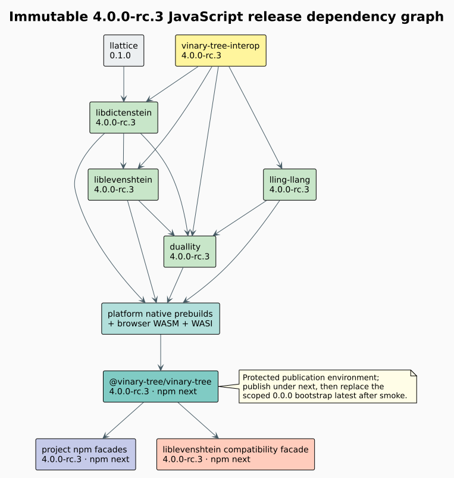

# Releasing `@vinary-tree/vinary-tree`

The runtime is a downstream assembly artifact. It must never publish before
the exact Rust crates and shared interop package it consumes are publicly
resolvable.



## Release identity

`release/version.json` is authoritative. For this train, every Rust and npm
coordinate is `4.0.0-rc.4`, and npm publication uses the `next` distribution
tag. npm's first-publication behavior assigned `latest` to the inert `0.0.0`
bootstrap reservation. After the OIDC-published runtime passes installed
native, WASM, and WASI smoke tests, retarget the new scoped package's `latest`
pointer to `4.0.0-rc.4`, remove `bootstrap`, and deprecate `0.0.0`.

The runtime's exact Rust requirements deliberately reject a mixed family. The
development overlay changes only source location; it does not relax versions.
Native SDK bootstrap invokes every component with `--locked` from that
component's repository root. This applies the owner's portable Cargo settings
without leaking the runtime's broader patch overlay into an independent
lockfile. Every component lock must remain byte-for-byte unchanged.

## Exact-tag workflow protocol

Pushing the annotated tag creates only the immutable source ref. Release
validation and publication are explicit manual dispatches so the complete
cross-project tag graph and public prerequisites can be established first.

The canonical tag predates protected GitHub-release approval. Append-only
corrective source `v4.0.0-rc.4-release.1` added those authority boundaries.
Its validate-only matrix exposed a separate topology defect: family repositories
were cloned beneath the runtime checkout, so owner-crate Cargo builds inherited
the runtime's `[patch.crates-io]` overlay and rejected their otherwise unchanged
lockfiles. No package-registry job ran.

Append-only corrective source `v4.0.0-rc.4-release.2` fixes the topology and
records every family checkout in `release/version.json` as an exact immutable
tag. Native, browser-WASM, WASI, and development integration jobs now place
family owners beside the runtime checkout. Both the checkout helper and local
layout validation reject nested owner roots. Package identity remains
`4.0.0-rc.4`; neither prior tag is moved.

The release workflow has two fail-closed modes. `validate-only` builds all six
native prebuilds plus browser WebAssembly and WASI, assembles the npm tarball,
verifies its contents, and creates the checksummed GitHub prerelease. `npm`
repeats the same immutable-tag gates and then enters only the protected npm
environment.

```bash
gh workflow run release.yml \
  --repo vinary-tree/javascript-runtime \
  --ref v4.0.0-rc.4-release.2 \
  -f registry=validate-only

gh workflow run release.yml \
  --repo vinary-tree/javascript-runtime \
  --ref v4.0.0-rc.4-release.2 \
  -f registry=npm
```

Pushing the tag never uploads to npm. A manual branch dispatch fails before
building, and there is no multi-registry or bypass mode. The `npm` job uses the
repository's trusted publisher, provenance, and protected `npm` environment;
the local npm login is used only for read-back verification and dist-tag
management after publication.

The `github-release` environment has the same required reviewer and `v*` tag
policy as npm but stores no secret; it gates only the job-scoped
`GITHUB_TOKEN` used to create the checksummed prerelease.

## Required order

1. Publish independent leaf crate `llattice` at its own `0.1.0` version if the
   registry does not already contain the required release.
2. Publish `vinary-tree-interop` and verify installation from each supported
   registry coordinate.
3. Publish `libdictenstein`, `liblevenshtein`, `lling-llang`, and `duallity`
   crates at `4.0.0-rc.4` in dependency order.
4. Build the runtime's native prebuild matrix from the exact component tags in
   `release/version.json`; build browser WASM and WASI from the same source map.
5. Merge the platform artifacts, run package-content and installed-tarball
   smoke tests, then publish `@vinary-tree/vinary-tree@4.0.0-rc.4` with `next`.
6. Publish project-specific npm facades against that exact runtime.
7. Publish the unscoped `liblevenshtein@4.0.0-rc.4` compatibility facade with
   `next`; do not change the legacy `latest` tag.

## Native platform matrix

| Operating system | Architectures | Artifact directory |
|---|---|---|
| Linux | x64, arm64 | `native/prebuilds/linux-<arch>` |
| macOS | x64, arm64 | `native/prebuilds/darwin-<arch>` |
| Windows | x64, arm64 | `native/prebuilds/win32-<arch>` |

Each matrix job records source commits in SDK provenance, runs native behavior
and leak gates before stripping, and uploads only its `.node` file. The final
assembly job rejects duplicate paths and checks the six directories declared
by `release/version.json`; a missing, unexpected, or misspelled platform makes
publication fail closed.

## Authentication and two-factor approval

CI uses npm trusted publishing or an environment-scoped automation credential.
Interactive one-time passwords and recovery codes are never stored in the
repository, issue tracker, logs, or chat. The protected `npm`
environment is the human approval boundary when two-factor authentication
requires one.

## Failure recovery

Published versions and Git tags are immutable. If one platform or downstream
facade fails after partial publication, correct the pipeline and issue the
next unused candidate; never overwrite an earlier RC. npm rollback changes a
dist-tag only. The scoped bootstrap replacement happens after installed-
artifact smoke tests pass for every supported backend. Promotion of the legacy
unscoped
`liblevenshtein@latest` remains a separate final-release decision.
